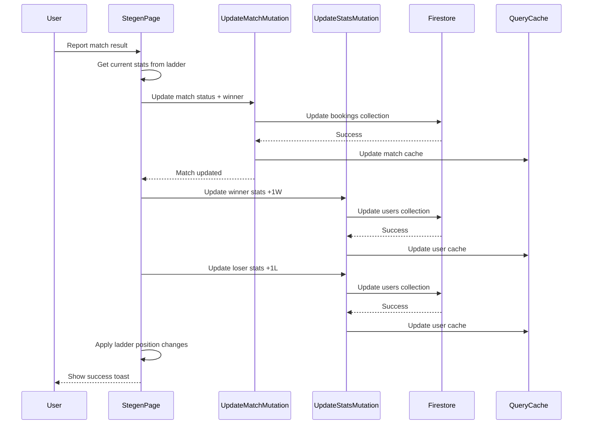

# Ladder Stats and Combined Matches Section

## Overview

This feature adds win/loss statistics (e.g., "3W 9L") to each player in the ladder and combines planned/completed matches into a single chronological section. Stats will be persisted in Firestore and updated when matches are completed.

## Current State Analysis

- User type in [`src/types/api.ts`](src/types/api.ts): Has `uid`, `email`, `displayName`, `phone`, `role`, `createdAt`
- Match data already includes `winnerId` when completed
- Matches are sorted by date (most recent first)
- Currently shows only "planned" matches in a separate section

## Implementation Steps

### 1. Update User Type to Include Stats

**File: [`src/types/api.ts`](src/types/api.ts)**

- Add optional `ladderWins?: number` field to `User` interface
- Add optional `ladderLosses?: number` field to `User` interface
- These fields default to 0 if not present

### 2. Update User API to Handle Stats

**File: [`src/lib/api.ts`](src/lib/api.ts)**

- In `usersApi.getUsers()`: Map `ladderWins` and `ladderLosses` from Firestore docs
- In `usersApi.getUser()`: Map `ladderWins` and `ladderLosses` from Firestore doc
- In `usersApi.updateUser()`: Allow updating `ladderWins` and `ladderLosses`

### 3. Create Stats Update Logic

**File: [`src/lib/ladder.ts`](src/lib/ladder.ts)**

- Add `updatePlayerStats()` function that increments winner's wins and loser's losses
- Returns object with `winnerId`, `loserId`, `winnerStats: {wins, losses}`, `loserStats: {wins, losses}`
- Add `formatPlayerStats()` helper: Takes wins/losses numbers, returns formatted string like "3W 9L" or "0W 0L"

### 4. Update Ladder Player Type

**File: [`src/lib/ladder.ts`](src/lib/ladder.ts)**

- Extend `LadderPlayer` interface to include:
  - `wins?: number`
  - `losses?: number`
- Update `buildLadderPlayers()` to include stats from User data

### 5. Create Stats Mutation Hook

**File: [`src/hooks/useUsers.ts`](src/hooks/useUsers.ts)**

- Add `useUpdateUserStatsMutation()` hook
- Accepts `userId` and `{ wins: number, losses: number }`
- Updates Firestore user document
- Optimistically updates query cache
- Handles rollback on error

### 6. Update Match Result Submission

**File: [`src/pages/Stegen.tsx`](src/pages/Stegen.tsx)**

- In `handleReportResult()` function:

  1. Get current stats for winner and loser from `ladder` array
  2. Calculate new stats (winner.wins + 1, loser.losses + 1)
  3. Call `updateLadderMatchMutation` (existing)
  4. On success, call `updateUserStatsMutation` for both players sequentially
  5. Update ladder override state with new positions
  6. Show success toast only after all updates complete

### 7. Display Stats in Ladder Table

**File: [`src/pages/Stegen.tsx`](src/pages/Stegen.tsx)**

- In ladder table (around line 334-386):
  - Add new `TableHead` column for "Statistik"
  - In each `TableRow`, add new `TableCell` displaying formatted stats
  - Use `formatPlayerStats(player.wins, player.losses)`
  - Style as `text-muted-foreground` for subtle appearance
  - Show "0W 0L" for players with no matches

### 8. Combine Planned and Completed Matches

**File: [`src/pages/Stegen.tsx`](src/pages/Stegen.tsx)**

- Remove separate `plannedMatches` filter (line 140-142)
- Keep all `ladderMatches` in chronological order (already sorted)
- Rename section from "Planerade stegen-matcher" to "Stegen-matcher"
- Update badge to show total count: `{ladderMatches.length} matcher`

### 9. Update Match Card Display Logic

**File: [`src/pages/Stegen.tsx`](src/pages/Stegen.tsx)**

- In match cards section (around line 443-528):
  - Check each match's `status` field
  - **For planned matches**: Show current UI (winner selection, comment input, action buttons)
  - **For completed matches**: Show read-only result display
    - Header: Show match date, court, and "Avklarad" badge
    - Body: Display "**[Winner Name]** vann över **[Loser Name]**" (bold player names)
    - If comment exists: Show below result in `text-muted-foreground`
    - No action buttons for completed matches

### 10. Create Match Result Display Helper

**File: [`src/pages/Stegen.tsx`](src/pages/Stegen.tsx)**

- Add `getMatchResultText()` helper function:
  - Takes `match`, `ladder` as parameters
  - Finds winner and loser from ladder by ID
  - Returns formatted result string
  - Handles missing player names gracefully

## Data Flow Diagram

## Files to Modify

1. [`src/types/api.ts`](src/types/api.ts) - Add stats fields to User interface
2. [`src/lib/api.ts`](src/lib/api.ts) - Add stats mapping in users API
3. [`src/lib/ladder.ts`](src/lib/ladder.ts) - Add stats to LadderPlayer, create helper functions
4. [`src/hooks/useUsers.ts`](src/hooks/useUsers.ts) - Add stats update mutation hook
5. [`src/pages/Stegen.tsx`](src/pages/Stegen.tsx) - Add stats column, combine match sections, update result submission

## UI/UX Considerations

- Stats display is compact: "3W 9L" format
- Completed matches clearly distinguishable from planned matches
- Bold player names in results for visual emphasis
- Most recent matches appear first (already sorted)
- Empty state when no matches exist: "Inga matcher ännu."
- Responsive design maintained for mobile devices
- Optimistic updates for immediate feedback
- Error handling with rollback if stats update fails

## Testing Checklist

After implementation:

- [ ] Stats display correctly in ladder table (0W 0L for new players)
- [ ] Stats update when match result is submitted
- [ ] Both players' stats update correctly (winner +1W, loser +1L)
- [ ] Planned matches show interactive form
- [ ] Completed matches show read-only result
- [ ] Match comments display when present
- [ ] Combined matches section shows all matches chronologically
- [ ] Ladder positions update after match completion
- [ ] Error handling works (rollback on failure)
- [ ] Responsive layout works on mobile

## Future Enhancements (Not in This Implementation)

- Match history pagination (when list grows large)
- Player stats trends/graphs
- Head-to-head records between players
- Filter matches by player
- Export match history
